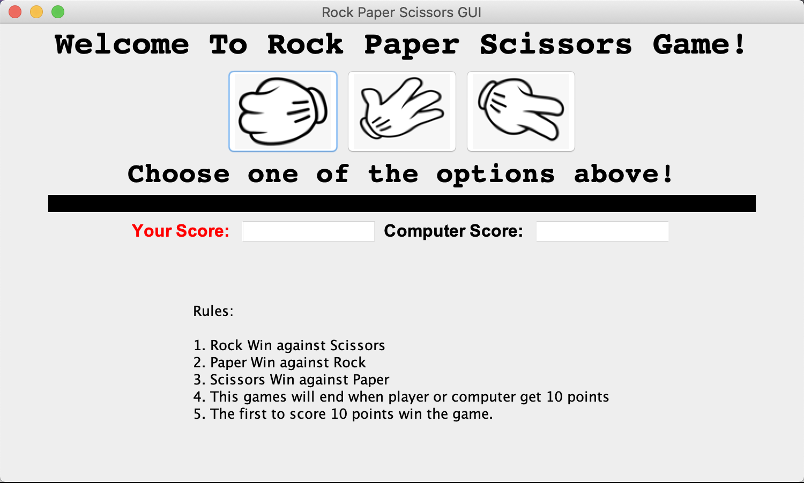

# Rock_Paper_Scissors_GUI
Simple GUI for Rock Paper Scissors games coded in Java. 
There are three buttons to choose from [Rock, Paper, Scissors]. 
When a button is pressed, the game should execute the fuction included in the Java code.
The first to score 10 points win the games and the Score will be reset. Good Luck!

# Overview

